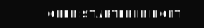

# Bolt Starter RR6

This is a starter template for AI-driven development with Bolt.

## Tech Stack

### Frontend

- **Core**: [React 18](https://18.react.dev/) with [React Router 6](https://reactrouter.com/en/6.29.0/)
- **UI Library**: [HeroUI](https://www.heroui.com/) (formerly NextUI)
- **Animation Library**: [Motion](https://motion.dev/) (formerly Framer Motion)
- **Icon Library**: [Phosphor](https://phosphoricons.com/)
- **Style**: [Tailwind CSS 3](https://v3.tailwindcss.com/)

### Backend

- **CDN**: Static assets served from [Netlify Edge Network](https://www.netlify.com/platform/core/edge/)

### Development

- **Dev Server**: [Vite](https://vitejs.dev/)
- **Code Formatter**: [Prettier](https://prettier.io/)
- **Code Linter**: [ESLint](https://eslint.org/)
- **Type Checker**: [TypeScript](https://www.typescriptlang.org/)

## Copyright

© 2025 Johnny Gérard
